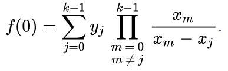
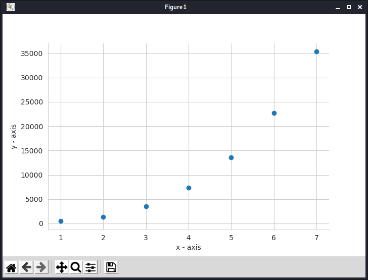
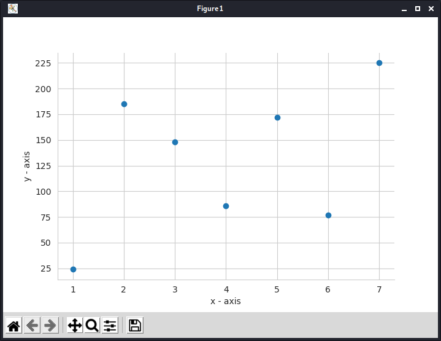
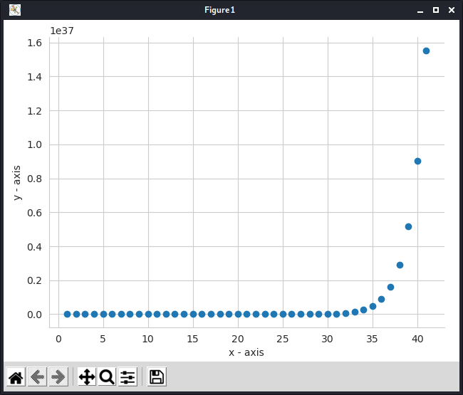
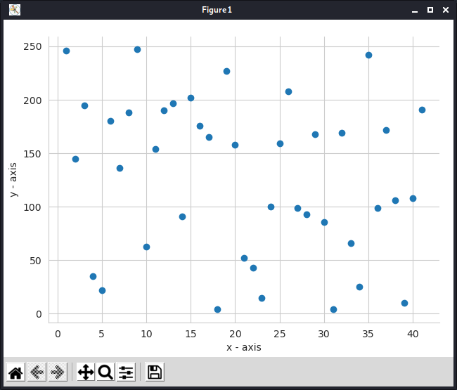
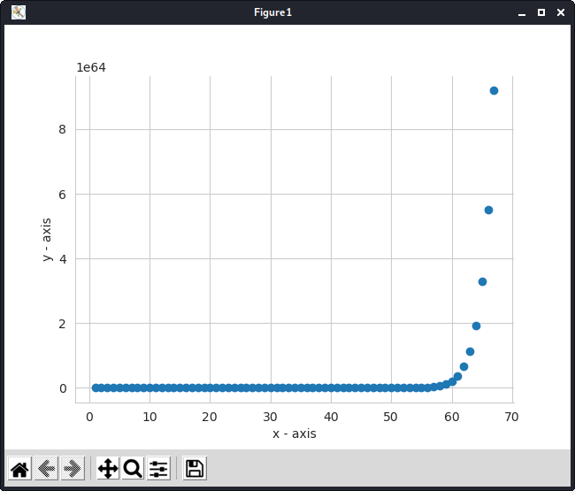
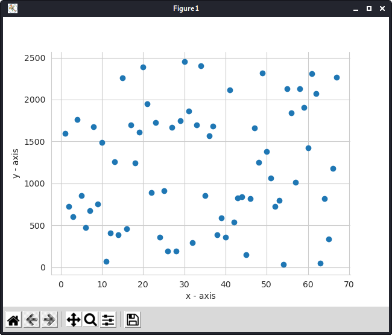

## Table of Contents

- [About](#about)
- [Explanation](#explanation)
- [Galois Fields](galois-fields)
- [Example](#example)
- [Setup](#setup)
- [End](#end)

## About

**Secret sharing** (also called **secret splitting**) refers to methods for distributing a _[secret](https://en.wikipedia.org/wiki/Secrecy "Secrecy")_ among a group of participants, each of whom is allocated a _share_ of the secret. The secret can be reconstructed only when a sufficient number, of possibly different types, of shares are combined together; individual shares are of no use on their own.

Secret sharing schemes are ideal for storing information that is highly sensitive and highly important. Examples include: [encryption keys](https://en.wikipedia.org/wiki/Encryption_key "Encryption key"), [missile launch codes](https://www.google.com "Be careful clinking this link :)"), and [numbered bank accounts](https://en.wikipedia.org/wiki/Numbered_bank_account "Numbered bank account"). Each of these pieces of information must be kept highly confidential, as their exposure could be disastrous, however, it is also critical that they should not be lost. Traditional methods for encryption are ill-suited for simultaneously achieving high levels of confidentiality and reliability. This is because when storing the encryption key, one must choose between keeping a single copy of the key in one location for maximum secrecy, or keeping multiple copies of the key in different locations for greater reliability. Increasing reliability of the key by storing multiple copies lowers confidentiality by creating additional attack vectors; there are more opportunities for a copy to fall into the wrong hands. Secret sharing schemes address this problem, and allow arbitrarily high levels of confidentiality and reliability to be achieved.

**Shamir's Secret Sharing**, formulated by [Adi Shamir](https://en.wikipedia.org/wiki/Adi_Shamir "Adi Shamir"), is one of the first [secret sharing](https://en.wikipedia.org/wiki/Secret_sharing) schemes in [cryptography](https://en.wikipedia.org/wiki/Cryptography "Cryptography"). It is based on [polynomial interpolation](https://en.wikipedia.org/wiki/Polynomial_interpolation "Polynomial interpolation") over [finite fields](https://en.wikipedia.org/wiki/Finite_field).

> Adi Shamir is also a co-inventor of the [Rivest–Shamir–Adleman](<https://en.wikipedia.org/wiki/RSA_(algorithm)> "RSA (algorithm)") (RSA) [algorithm](https://en.wikipedia.org/wiki/Algorithm "Algorithm") (along with [Ron Rivest](https://en.wikipedia.org/wiki/Ron_Rivest "Ron Rivest") and [Len Adleman](https://en.wikipedia.org/wiki/Len_Adleman "Len Adleman")).<br>


[Back To Top](#table-of-contents)

## Explanation

The secret is split into multiple parts, called **shares**, which are later used to **reconstruct** the original secret. To unlock the secret via Shamir's secret sharing, you need a minimum number of shares. This is called the **threshold**, and is used to denote the minimum number of shares needed to unlock the secret.

The essential idea of the scheme is based on [Lagrange interpolation theorem](https://en.wikipedia.org/wiki/Lagrange_polynomial "Lagrange polynomial"), specifically that _k_ points is enough to uniquely determine a polynomial of degree less than or equal to _k - 1_

For instance, 2 points are sufficient to define a line, 3 points are sufficient to define a parabola, 4 points to define a cubic curve and so forth.

We construct a polynomial such that our secret is encoded as the zeroth coefficient or the y-intercept of the function. Take random _k - 1_ elements as the rest of the coefficients _a1, a2, a3, ...., a(k-1)_, such that the final polynomial becomes
_f(x) = a<sub>0</sub> + a<sub>1</sub> x + a<sub>2</sub> x<sup>2</sup> + .... + a<sub>(k-1)</sub> x<sup>(k-1)</sup>_.
Now we can construct the shares required, by computing _(i, f(i))_ where _i_ is a natural number. Every participant is given a point (a non-zero integer input to the polynomial, and the corresponding integer output). Given any random subset of k of these pairs, we can obtain the secret (_a<sub>0</sub>_) with interpolation using the following formula:

> 

[Back To Top](#table-of-contents)

## Galois Fields

In mathematics, a [**finite field**](https://en.wikipedia.org/wiki/Finite_field) or **Galois field** (so-named in honor of [Évariste Galois](https://en.wikipedia.org/wiki/%C3%89variste_Galois)) is a field that contains a finite number of elements. As with any field, a finite field is a set on which the operations of multiplication, addition, subtraction and division are defined and satisfy certain basic rules. The most common examples of finite fields are given by the **integers mod _p_** when _p_ is a prime number.

Unlike the real field where we have infinite number of coordinates and axes, a finite field is limited to certain number of elements. The number of elements of a finite field is called its _order_ or, sometimes, its _size_. A finite field of order _q_ exists if and only if _q_ is a prime power _p<sup>k</sup>_ (where _p_ is a prime number and _k_ is a positive integer). In a field of order _p<sup>k</sup>_, adding _p_ copies of any element always results in zero; that is, the characteristic of the field is _p_.

> Most common galois fields are the prime fields, for e.g. GF (256) or GF(2<sup>8</sup>) which is also used in the RSA encryption.


[Back To Top](#table-of-contents)

## Example

Let the secret be **s = 245**, number of shares be **n = 7** and the threshold be **k = 4**. This means that we need to generate 7 pairs of points to share among the members, and any 4 members can reconstruct the secret using their pairs. We choose random _k - 1_ numbers **18**, **84** and **184**. Therefore _a<sub>0</sub> = 245, a<sub>1</sub> = 18, a<sub>2</sub> = 84, a<sub>3</sub> = 184_,
and our polynomial becomes:
_f(x) = 245 + 18 x + 84 x<sup>2</sup> + 184 x<sup>3</sup>_

Now we can generate 7 points by putting _x = 1, 2, 3, ..., 7_ in our polynomial. We get
_D<sub>1</sub> = (1, 461), D<sub>2</sub> = (2, 1529), D<sub>3</sub> = (3, 4133), D<sub>4</sub> = (4, 8957), D<sub>5</sub> = (5, 16685), D<sub>6</sub> = (6, 28001), D<sub>7</sub> = (7, 43589)_

Now, given these shares, we would need only 4 pairs to reconstruct our polynomial and get the free coefficient as our original secret. Which can be done using the formula given above.

Although the simplified version of the method demonstrated above, which uses integer arithmetic rather than finite field arithmetic, works fine, there is a security problem. Suppose that we know 3 points _D<sub>3</sub>, D<sub>7</sub>, D<sub>4</sub>_. We still don't know the minimum number of points to construct the polynomial, but if we combine this with the public info, (n = 7, k = 4), our polynomial should look something like _f(x) = S + a<sub>1</sub>x + a<sub>2</sub>x<sup>2</sup> + a<sub>3</sub>x<sup>3</sup>_. By putting in the values for the 3 points we know, we get 3 equations and 4 unkowns which finally results in a linear relation of two variables with a negative slope. Since every coefficient is a natural number, this narrows down the possibilities and can be done via simple brute-forcing. Geometrically this attack exploits the fact that we know the order of the polynomial and so gain insight into the paths it may take between known points. This reduces possible values of unknown points since it must lie on a smooth curve.

This problem can be fixed by using finite field arithmetic. The graph shows a polynomial curve over a finite field, in contrast to the usual smooth curve it appears very disorganised and disjointed.




[Back To Top](#table-of-contents)

## Setup

- Make sure you have [Python3](https://python.org) installed on your system.
- Run `git clone https://github.com/adviksinghania/sharmir-secret-sharing` to clone the repo and `cd shamir-secret-sharing` to navigate inside the directory.
- Run `sudo python3 -m pip install -r requirements.txt` to install the required libraries (matplotlib, seaborn).
- You can run the individual scripts for the algorithm with or without the galois field with a pre-defined driver code, or type `python3 main.py -h` for info on how to use the main script.
- Now run the `main.py` file by giving inline arguments to the terminal like this...
  ```bash
  $ python main.py --secret 2357 --shares 12 --threshold 5
  ```
  Or
  ```bash
  $ python main.py -S 14351 -s 22 -t 10
  ```

## End:

**More examples:**






**NOTE:** I've added docstrings and comments wherever needed in the scripts so that it's easy to understand.

> Check out [Matt Parker's video](https://youtu.be/K54ildEW9-Q "How to keep an open secret with mathematics.") for a wonderful explanation for this cipher.

> Another benefit of using prime fields is that the output of the polynomial will be small compared to the polynomial using integer arithmetic, where the numbers may even cross the range of _int_ and therefore, the secret may not be properly reconstructed.

[Back To Top](#table-of-contents)

If you have any doubts, you can reach me on [Twitter](https://twitter.com/SinghaniaAdvik), [LinkedIn](https://www.linkedin.com/in/adviksinghania/), or [Instagram](https://www.instagram.com/half.viking/)


